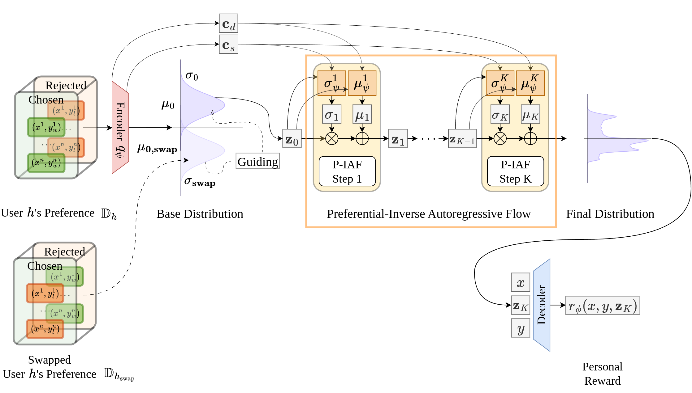

<h1 align="center">FLPL</h1>
<h2 align="center">title</h2>

## ✨Summary
This repository provides the implementation of **Flow Latent-based Preference Learning (FLPL)**.

<p align="center">
  
</p>

## ✨Environment Setting
Clone this repository and run:

```
conda create -n flpl python=3.10
conda activate flpl
pip install -r requirements.txt
```
## ✨Dataset Generation
Run the following commands with the model of your choice:
```bash
# For Pets
bash generate_llm_embedding_pets.sh

# For UF-P-2
python -m config.data_utils.ultrafeedback_augment -a 84 -n P
bash generate_llm_embedding_UF_P_2.sh

# For UF-P-4
python -m config.data_utils.ultrafeedback_augment -a single -n P_4 -c
bash generate_llm_embedding_UF_P_4.sh

```
You may change the model names in the script files if needed.

## ✨Experiments

Our model FLPL can be evaluated on genarated datasets, along with all baseline models included in the paper.

For example:

- **run_pets.sh** runs FLPL on the Pets dataset with Llama-3.1-8B.

- **run_p4.sh** runs FLPL on the UF-P-4 dataset with Llama-3.2-3B.
```bash
# FLPL in Pets
bash run_pets.sh
# FLPL in UF-P-4
bash run_p4.sh 
```
Additional examples for running experiments on other datasets and model sizes can be found in the corresponding sbatch_[data]_[model_size].sh files.
